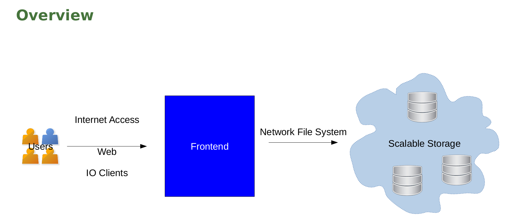
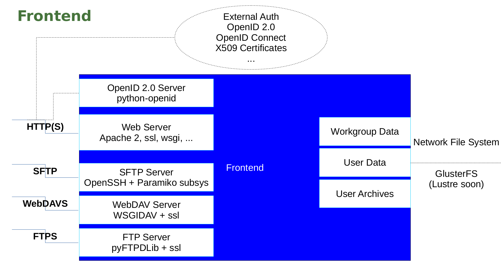
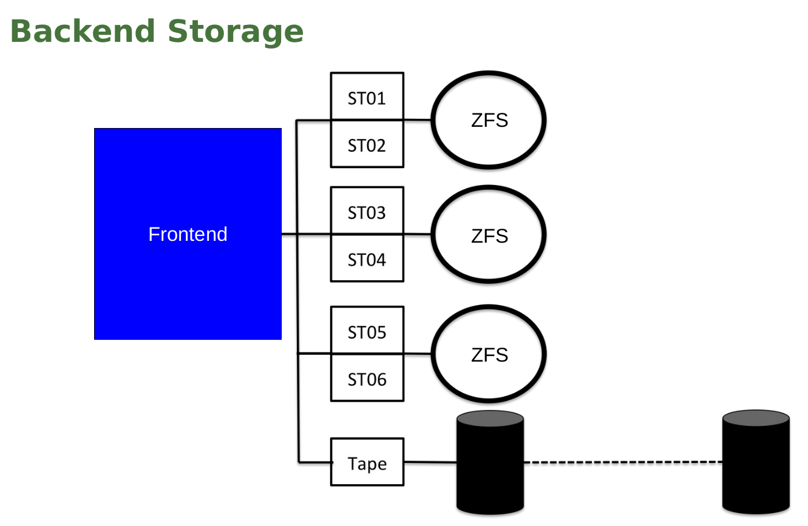

Overview
========
Considering the overview in the diagram below

the docker-migrid container basically provides the parts and services covered in
Frontend on

where the docker setup relies on simpel local storage whereas
production systems typically rely on a separate network backend
storage to cluster a number of storage bricks as outlined below.

Further optional components like Jupyter, Cloud and Seafile run on
stand-alone systems but are more or less integrated and exposed
through the Web server at the Frontend.
