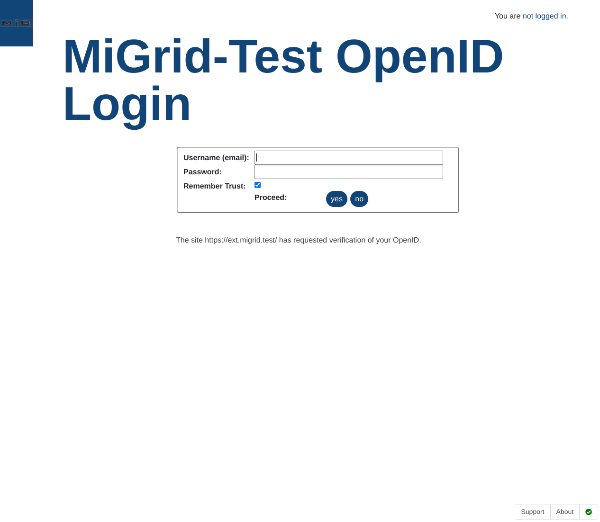
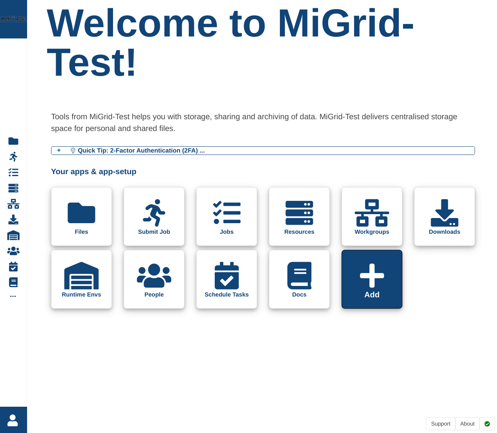

Deploying
=========

To deploy the MiGrid service, the Docker MiGrid package makes use of Docker-Compose as introduced in the prerequisites section.

The easiest way to deploy the Docker MiGrid services, is to execute the following command::

    docker-compose up -d

To stop the services, execute the following command::

    docker-compose down

After this command has been executed, a succesful launch would launch the 4 following containers::

    CONTAINER ID   IMAGE                            COMMAND                  CREATED         STATUS         PORTS                                                                                                                                                                                                                                            NAMES
    419e4ede2af3   nielsbohr/migrid:basic           "/tini -- /app/docke…"   4 minutes ago   Up 4 minutes   80/tcp, 0.0.0.0:2222->2222/tcp, :::2222->2222/tcp, 0.0.0.0:4443->4443/tcp, :::4443->4443/tcp, 0.0.0.0:8021->8021/tcp, :::8021->8021/tcp, 0.0.0.0:8443->8443/tcp, :::8443->8443/tcp, 443-448/tcp, 0.0.0.0:22222->22222/tcp, :::22222->22222/tcp   migrid-io
    c06b70410fa7   jwilder/nginx-proxy              "/app/docker-entrypo…"   4 minutes ago   Up 4 minutes   0.0.0.0:80->80/tcp, :::80->80/tcp, 0.0.0.0:443-448->443-448/tcp, :::443-448->443-448/tcp                                                                                                                                                         nginx-proxy
    604bbebc6088   nielsbohr/migrid:basic           "/tini -- /app/docke…"   4 minutes ago   Up 4 minutes   80/tcp, 443-448/tcp, 2222/tcp, 4443/tcp, 8021/tcp, 22222/tcp                                                                                                                                                                                     migrid
    6df1818e879c   ruudud/devdns                    "/run.sh"                4 minutes ago   Up 4 minutes   127.0.0.1:53->53/udp                                                                                                                                                                                                                             devdns

You now should be able to access the basic MiGrid page via the URL::

    https://migrid.test

This should take you to the default OpenID login page. The default development credentials for this is set in the `docker-compose.yml` file
under the `migrid` container `command` option::

    command: /app/docker-entry.sh -u test@migrid.test -p TestPw0rd -s "sftp ftps webdavs"

As shown here, the default user is set to `test@migrid.test` and with the password `TestPw0rd`.

With these credentials, the authentication should redirect you to the Welcome page as shown below.

