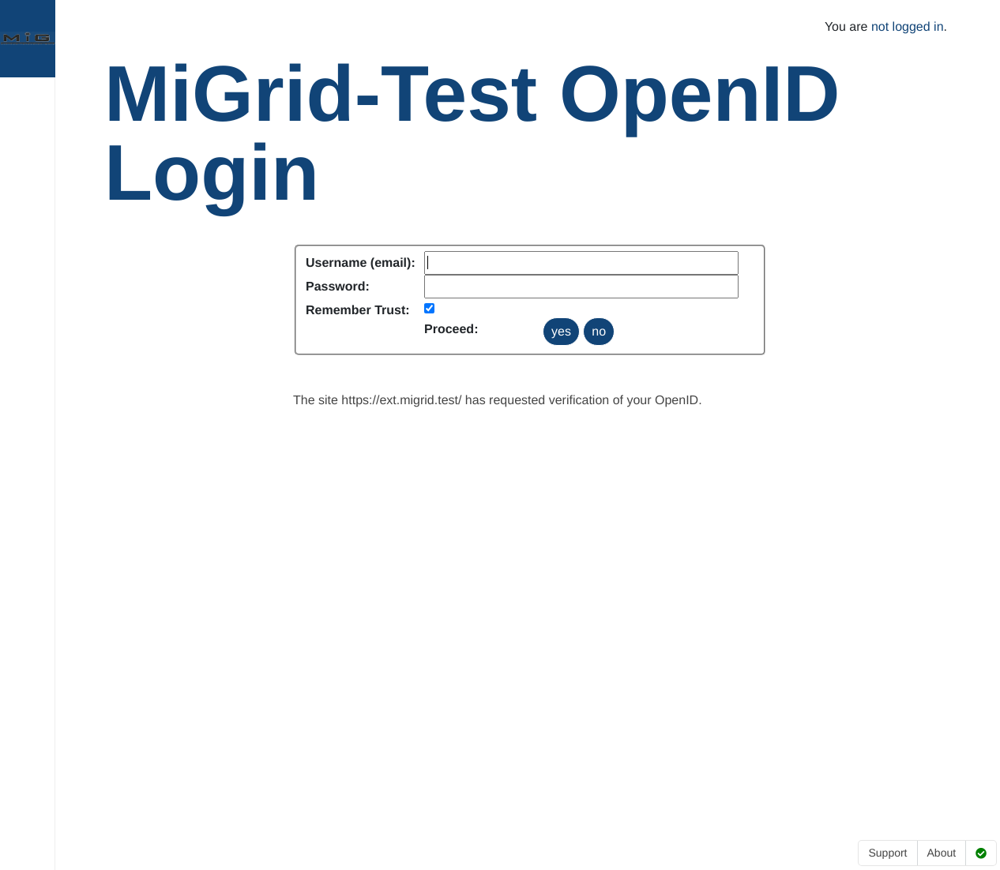

Deploying
=========

To deploy the MiGrid service, the Docker MiGrid package makes use of Docker-Compose as introduced in the prerequisites section.

The easiest way to deploy the Docker MiGrid services, is to execute the following command::

    make up

To stop the services, execute the following command::

    make down

After this command has been executed successfully it should have launched the following containers::

    CONTAINER ID   IMAGE                   COMMAND                  CREATED        STATUS                       PORTS                                                                                                                                                              NAMES
    337cae2e6471   jwilder/nginx-proxy     "/app/docker-entrypo…"   20 hours ago   Up About an hour             0.0.0.0:80->80/tcp, [::]:80->80/tcp, 0.0.0.0:443-448->443-448/tcp, [::]:443-448->443-448/tcp                                                                       nginx-proxy
    c4724837c7d2   ucphhpc/migrid:latest   "/tini -- /app/docke…"   20 hours ago   Up About an hour             80/tcp, 443-449/tcp, 2222/tcp, 0.0.0.0:8021->8021/tcp, [::]:8021->8021/tcp, 4443/tcp, 22222/tcp, 0.0.0.0:8100-8399->8100-8399/tcp, [::]:8100-8399->8100-8399/tcp   migrid-ftps
    7cb4de0150aa   ucphhpc/migrid:latest   "/tini -- /app/docke…"   20 hours ago   Up About an hour             80/tcp, 443-449/tcp, 2222/tcp, 4443/tcp, 8021/tcp, 22222/tcp                                                                                                       migrid
    ac97198536d4   ucphhpc/migrid:latest   "/tini -- /app/docke…"   20 hours ago   Up About an hour             80/tcp, 443-449/tcp, 4443/tcp, 0.0.0.0:2222->2222/tcp, [::]:2222->2222/tcp, 8021/tcp, 0.0.0.0:22222->22222/tcp, [::]:22222->22222/tcp                              migrid-sftp
    82975e100876   ucphhpc/migrid:latest   "/tini -- /app/docke…"   20 hours ago   Up About an hour             80/tcp, 443-449/tcp, 2222/tcp, 4443/tcp, 8021/tcp, 22222/tcp, 0.0.0.0:8443->8443/tcp, [::]:8443->8443/tcp                                                          migrid-openid
    730dae7352a7   ucphhpc/migrid:latest   "/tini -- /app/docke…"   20 hours ago   Up About an hour             80/tcp, 443-449/tcp, 2222/tcp, 8021/tcp, 22222/tcp, 0.0.0.0:4443->4443/tcp, [::]:4443->4443/tcp                                                                    migrid-webdavs
    3d4ec5f5158a   mwader/postfix-relay    "/root/run"              20 hours ago   Up About an hour (healthy)   127.0.0.1:2525->25/tcp                                                                                                                                             devmail
    42e818a14b9e   lmendelowski/devdns     "/run.sh"                20 hours ago   Up About an hour             127.0.0.1:53->53/udp                                                                                                                                               devdns

DNS setup for development
-------------------------

Before your host will be able to discover the various migrid services, it needs to know
that it should ask the `devdns` container for the IP associated with those service containers.
Therefore, you need to apply one of the options listed in the (Host Machine -> Containers)
section at `DevDNS <https://github.com/lcmen/devdns#host-machine--containers>`_.

.. note::
    We have decided to use the fork linked above instead of the original repository
    (https://github.com/ruudud/devdns) that was apparently abandoned, since the docker client
    the original uses is outdated.

We recommend the least invasive method, namely to reconfigure the host machine's resolv.conf (in the case of a Unix-like system)
such that it asks the localhost devdns container as the **(IMPORTANT) first nameserver** before any other nameserver::

    #/etc/resolv.conf
    nameserver 127.0.0.1
    
    # Followed by your normal nameservers

Do note, that `resolv.conf` is often reset between reboots, and therefore the `nameserver 127.0.0.1`
resolv will likely have to be configured via your specific network manager or added again each time.

An alternative is to use the exposed ports on localhost instead of connecting to the containers directly.
This is also helpful on MacOS where Docker runs inside a VM and one cannot directly reach the Docker bridge.
To use the exposed ports just add the migrid domain names to your `/etc/hosts`::

    127.0.0.1     migrid.test sid.migrid.test oid.migrid.test www.migrid.test io.migrid.test sftp.migrid.test webdavs.migrid.test ftps.migrid.test ext.migrid.test

Afterwards you should be able to resolve the migrid containers under the test domain:

    > ping migrid.test

    PING migrid.test (172.17.0.1) 56(84) bytes of data.
    64 bytes from migrid.test (172.17.0.1): icmp_seq=1 ttl=64 time=0.084 ms
    64 bytes from migrid.test (172.17.0.1): icmp_seq=2 ttl=64 time=0.099 ms

    > ping openid.migrid.test
    
    PING openid.migrid.test (172.17.0.2) 56(84) bytes of data.
    64 bytes from openid.migrid.test (172.17.0.2): icmp_seq=1 ttl=64 time=0.137 ms
    64 bytes from openid.migrid.test (172.17.0.2): icmp_seq=2 ttl=64 time=0.077 ms

After this is completed, you should be able to access the basic MiGrid page via the URL::

    https://migrid.test

If you are running `docker-migrid` on a remote server, this might give you a redirection error. If so try the following URL instead.
If neither of these two URLs takes you to the described OpenID login page. Please get in touch with us.::

    https://ext.migrid.test

This should take you to the default OpenID login page. The default development credentials for this is set in the `docker-compose.yml` file
under the `migrid` container `command` option::

    command: /app/docker-entry.sh -V -u ${MIG_TEST_USER} -p ${MIG_TEST_USER_PASSWORD} -s "sftp ftps webdavs"

The above command creates a user on container startup. You can change the user/password in your .env file
This should only be used for development and testing purposes.
Public hosts should create users through sign up or admin interface.

With these credentials, the authentication should redirect you to the Welcome page as shown below.

DNS setup for production
------------------------

When running MiGrid in production, DNS is usually handled by an external service. Also a major difference might be that all HTTPS services should run on port 443 to be reachable by client without further knowledge.

To achieve that docker-migrid usually runs on multiple IP addresses instead of using SNI.
This way is doesn't matter in how many separate servers the setup is split.
At least 5 IP addresses are used by default to separate different services from each other:

.. list-table:: Standard IP address setup
   :widths: 25 25 50
   :header-rows: 1

   * - Domain
     - example IP
     - Description
   * - migrid.test \*.migrid.test 
     - 10.0.0.1
     - The web interface (front page) with info and login screen (``$DOMAIN``, ``$WILDCARD_DOMAIN``)
   * - ext.migrid.test
     - 10.0.0.2
     - Handles migrid\'s OWN OpenID (``$MIGOID_DOMAIN``)
   * - oid.migrid.test
     - 10.0.0.3
     - Handles the external OpenID (``$EXTOID_DOMAIN``)
   * - sid.migrid.test
     - 10.0.0.4
     - Session ID webinterface for signup+login (``$SID_DOMAIN``)
   * - io.migrid.test
     - 10.0.0.5
     - Storage frontend protocols like sftp, ftps, webdavs (``$IO_DOMAIN``)

Of course you can add more IPs for all the other domain if you want to fan out the services even more.
