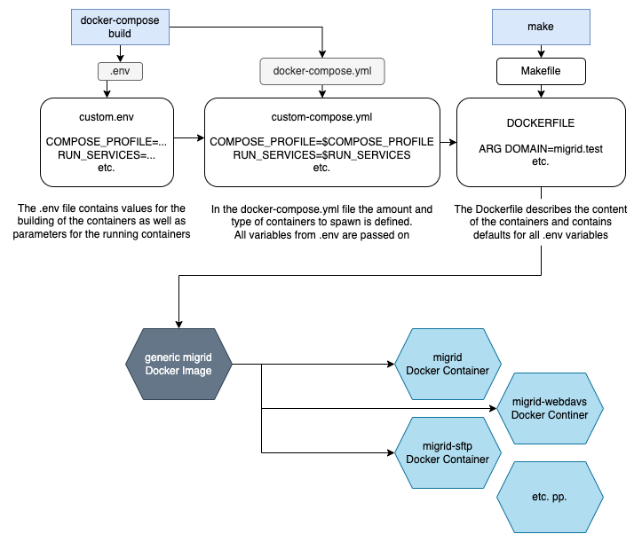

Introduction
============

Before we can get started with Docker MiGrid, a good place to start, is to get an understanding of the repository itself and how it is structured.
This repository provides a ``Makefile`` which allows fast and easy setup and teardown of docker-migrid deployments.
A deployment is definded by a set of environment variables and corresponding ``docker-compose.yml`` and ``Dockerfile`` files.

Docker MiGrid Structure
-----------------------

The Docker MiGrid is build up of several different components and services.
These have been seperated into two different categories, Associated services and MiGrid services.

Associated Services
-------------------

The Associated services, are services that makes it possible to host and run the MiGrid on your local machine.
These include the dynamic DNS service (devdns), and the Proxy service (nginx-proxy).

- devmail
    This service provides a simple Postfix based email relay. Make sure to set the ``$SMTP_SERVER`` variable to use this.
    For development only, as it is an open relay!

- devdns
    This service ensures that every container name is registered as an DNS entry in the devdns service under the `test` domain.
    In addition, it makes it possible for us to register additional aliases for each container, whereby they also can be reached.
    These additional aliases can be seen in the `docker-compose.yml` file.

- nginx-proxy
    The nginx-proxy service is responsible for forwarding HTTP/HTTPS requests to its designated url target.
    It is configured with the `nginx-proxy.conf` file, which is loaded upon launch.

MiGrid Services
---------------

The MiGrid services are composed of a number of different container services that each have their designated role.

.. _migrid_desc:

- migrid
    This is the main service that provides the basic MiGrid functionality, this includes the web interface and most of 
    its associated services. This includes features such as data management via the built-in filemanager, managing and creating WorkGroups,
    and establishing Share Links.

.. _migrid_openid_desc:

- migrid-openid
    migrid-openid as the name indicates runs the built-in OpenID service, which can be used to authenticate e.g. external users on the MiGrid website.

.. _migrid_sftp_desc:

- migrid-sftp
    The migrid-sftp service host's and runs the SFTP service, which enables the user to conduct data management tasks against their
    MiGrid home directory and sharelinks.

.. _migrid_ftps_desc:

- migrid-ftps
    This is similar to the `migrid-sftp` but just runs the FTPS service.

.. _migrid_webdavs_desc:

- migrid-webdavs
    WebDAVS is like the SFTP and FTPS services, but just provides WebDAV via the HTTPS protocol.

.. _migrid_io_desc:

- migrid-io
    The migrid-io services is responsible for bundling and exposing all io services, that are not part of the basic MiGrid service.
    This is in addition to it also providing the OpenID authentication services, which is also not part of the basic MiGrid service.
    In terms of io services, the `migrid-io` service supports the SFTP, WebDAVS, and FTPS protocols.
    This service is can be used instead of the single protocol services.

Although the MiGrid Docker container contains all services, it is recommended to start multiple containers, each with as few services as possible. Eg. one container for the MiGrid webservices and one for each data transfer.
You find an example in the docker-compose files in this repository.

    :ref:`migrid <migrid_desc>`, :ref:`migrid-openid <migrid_openid_desc>`, :ref:`migrid-sftp <migrid_sftp_desc>`, :ref:`migrid-ftps <migrid_ftps_desc>`, and :ref:`migrid-webdavs <migrid_webdavs_desc>`

